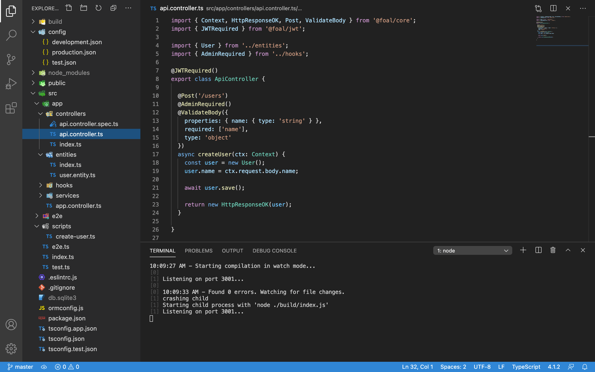

<p align="center">
  
  <br>
  <a href="https://foalts.org">https://foalts.org</a>
</p>

<p align="center">
  <a href="https://github.com/FoalTS/foal/blob/master/LICENSE">
    
  </a>
  <a href="https://snyk.io/test/npm/@foal/core">
    
  </a>
  <a href="https://github.com/FoalTS/foal/commits/master">
    
  </a>
  <a href="https://github.com/FoalTS/foal/commits/master">
    
  </a>
</p>


## What is Foal?


*Foal* (or *FoalTS*) is a Node.JS framework for creating web applications.

It provides a set of ready-to-use components so you don't have to reinvent the wheel every time. In one single place, you have a complete environment to build web applications. This includes a CLI, testing tools, frontend utilities, scripts, advanced authentication, ORM, deployment environments, GraphQL and Swagger API, AWS utilities, and more. You no longer need to get lost on npm searching for packages and making them work together. All is provided.

But while offering all these features, the framework remains simple. Complexity and unnecessary abstractions are put aside to provide the most intuitive and expressive syntax. We believe that concise and elegant code is the best way to develop an application and maintain it in the future. It also allows you to spend more time coding rather than trying to understand how the framework works.

Finally, the framework is entirely written in TypeScript. The language brings you optional static type-checking along with the latest ECMAScript features. This allows you to detect most silly errors during compilation and improve the quality of your code. It also offers you autocompletion and a well documented API.



## Development Policy

### Thousands of Tests

Testing FoalTS is put on a very high priority. Providing a reliable product is really important to us. As of December 2020, the framework is covered by more than 2100 tests.

### Documentation

New features, no matter what they offer, are useless if they are not well documented. Maintaining complete and quality documentation is key to the framework. If you think something is missing or unclear, feel free to open an issue on Github!

### Product Stability

Great attention is paid to the stability of the product. You can find out more by consulting our [dependency policy](https://github.com/FoalTS/foal/blob/master/.github/CONTRIBUTING.MD#dependency-policy), [semantic versioning rules](https://github.com/FoalTS/foal/blob/master/.github/CONTRIBUTING.MD#semantic-versioning) and [long-term support policy](https://github.com/FoalTS/foal/blob/master/.github/CONTRIBUTING.MD#long-term-support-policy-and-schedule).

## :city_sunrise: Get started

First install [Node.Js and npm](https://nodejs.org/en/download/).

### Create a new app

```
$ npm install -g @foal/cli
$ foal createapp my-app
$ cd my-app
$ npm run dev
```

The development server is started! Go to `http://localhost:3001` and find our welcoming page!

:point_right: [Continue with the tutorial](https://foalts.org/docs) :seedling:

## Backers

[](https://github.com/sponsors/LoicPoullain)

## Community Chat

You can join the community chat [here](https://discord.gg/QUrJv98).

## Contributing

See the [contribution guidelines](https://github.com/FoalTS/foal/blob/master/.github/CONTRIBUTING.MD).

## License

MIT 
